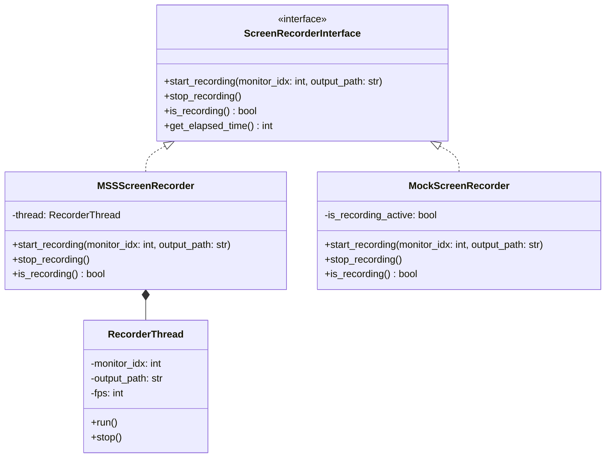

# Rencana Pengembangan Fitur Screen Recording

Dokumen ini berisi rencana arsitektur modular, strategi pengujian, dan implementasi GUI untuk fitur perekaman layar (screen recording) pada aplikasi Muf Studio.

## 1. Kebutuhan Fungsional & Non-Fungsional
*   **Perekaman Seluruh Layar:** Sistem dapat merekam keseluruhan area dari monitor yang dipilih.
*   **Dukungan Multi-Monitor:**
    *   Sistem mendeteksi semua monitor yang terhubung secara dinamis.
    *   Jika terdeteksi lebih dari 1 monitor, berikan opsi Dropdown/ComboBox pada panel kontrol untuk memilih monitor mana yang akan direkam.
    *   Jika hanya ada 1 monitor, ComboBox otomatis memilih monitor tersebut dan dapat dinonaktifkan/tetap ditampilkan secara informatif.
*   **Kontrol Perekaman (Start/Stop):** Menyediakan tombol pemicu perekaman pada GUI Panel Kontrol beserta indikator status (Durasi/Status).
*   **Format Output Video:** Menyimpan hasil rekaman dalam format video standar (MP4 menggunakan `mp4v` codec melalui OpenCV) di folder khusus `recordings/`.
*   **Performa & Responsivitas:** Proses penangkapan layar (capture) dan penulisan video (write) harus berjalan pada thread terpisah (`QThread`) agar tidak memblokir Main GUI thread dan menjaga frame rate perekaman stabil (target ~30 FPS).
*   **Aman & Teruji (TDD):** Pengujian unit dan integrasi menggunakan `pytest` dan `pytest-qt` sebelum memodifikasi kode utama.

---

## 2. Desain Arsitektur (SOLID)

Arsitektur fitur perekaman layar dirancang secara modular dan didecouple dari GUI menggunakan design pattern Service/Interface:



### A. `muf_studio/recorder.py` (Modul Perekam Layar)
*   **`ScreenRecorderInterface` (Abstraction):** Kelas abstrak dasar untuk perekaman layar. Memudahkan unit testing.
*   **`MSSScreenRecorder` (Implementation):** Implementasi riil perekaman layar.
    *   Menggunakan library **`mss`** untuk menangkap screen frame dengan performa sangat tinggi (memanfaatkan Windows Desktop Duplication / API native).
    *   Menggunakan **`cv2.VideoWriter`** untuk menyusun frame-frame tersebut menjadi file MP4.
    *   Menjalankan penulisan frame di dalam `RecorderThread` (`QThread`) untuk mencegah UI lag.
*   **`MockScreenRecorder` (Implementation):** Implementasi tiruan (mock) yang mensimulasikan proses perekaman tanpa memanggil API hardware/OS nyata. Digunakan untuk test suite agar CI/CD test dapat berjalan tanpa display head.
*   **`RecorderThread` (Worker Thread):** Kelas `QThread` yang bertugas menangkap frame dari monitor terpilih menggunakan `mss` pada interval waktu konstan (misal, 33ms untuk 30 FPS) dan menulisnya ke video.

### B. `muf_studio/control_panel.py` (GUI Control Panel)
*   Menambahkan Group Box baru: **"Screen Recording Controls"** di bawah panel kontrol yang sudah ada.
*   **UI Components:**
    *   `monitor_combo`: Dropdown `QComboBox` untuk memilih monitor. Berisi nama monitor & resolusi (contoh: `"Monitor 1: \\\\.\\\\DISPLAY1 (1920x1080)"`).
    *   `record_button`: Tombol `QPushButton` dengan toggle state (`"⏺ Start Recording"` dan `"🛑 Stop Recording"`).
    *   `status_label`: Label informasi status perekaman dan durasi waktu berjalan (contoh: `"REC 00:12"`, `"Ready"`, `"Saving..."`).
*   **Sinyal & Slot:**
    *   `start_recording_requested(int)`: Dipancarkan saat tombol record ditekan untuk memulai rekaman pada monitor index tertentu.
    *   `stop_recording_requested()`: Dipancarkan saat tombol record ditekan kembali untuk menghentikan rekaman.

---

## 3. Strategi Pengujian (Test Driven Development)

Kita akan membuat test suite terlebih dahulu di file `tests/test_recorder.py` sebelum menulis kode fitur.

1.  **Unit Test Recorder (`tests/test_recorder.py`):**
    *   Menguji bahwa `MockScreenRecorder` dapat bertransisi state dari idle -> recording -> stopped dengan benar.
    *   Menguji bahwa service dapat menghitung durasi waktu rekam (`get_elapsed_time`).
    *   Menguji deteksi monitor (mengembalikan list monitor yang valid, minimal 1 monitor utama).
2.  **GUI Integration Test (`tests/test_recorder_gui.py`):**
    *   Menguji penambahan UI perekaman pada `ControlPanelWindow`.
    *   Menguji bahwa combobox monitor menampilkan pilihan monitor yang sesuai dengan jumlah monitor sistem.
    *   Menguji klik tombol rekam memicu pemancaran sinyal dengan argumen index monitor yang tepat.

---

## 4. Rencana Langkah Kerja

1.  **Langkah 1:** Tambahkan library `mss` ke dependensi project menggunakan perintah:
    ```bash
    uv add mss
    ```
2.  **Langkah 2 (TDD Red Phase):** Buat file test `tests/test_recorder.py` yang mendefinisikan interface dan pengujian awal untuk `ScreenRecorderInterface`, `MSSScreenRecorder`, dan `MockScreenRecorder`.
3.  **Langkah 3 (Green Phase):** Implementasikan `muf_studio/recorder.py` dengan kelas interface, mock, dan real implementation hingga tes awal lulus.
4.  **Langkah 4 (TDD GUI Red Phase):** Buat file test `tests/test_recorder_gui.py` untuk menguji integrasi panel kontrol.
5.  **Langkah 5 (GUI Green Phase):** Perbarui `muf_studio/control_panel.py` untuk menambahkan UI perekam layar dan integrasikan di `main.py`.
6.  **Langkah 6:** Jalankan uji regresi penuh menggunakan `uv run pytest` untuk memastikan tidak ada fitur lama yang rusak.
7.  **Langkah 7:** Buat laporan akhir di `docs/ai_report/007_screen_recording_feature.md` dan merge branch `feature/screen-recording` ke `main`.
